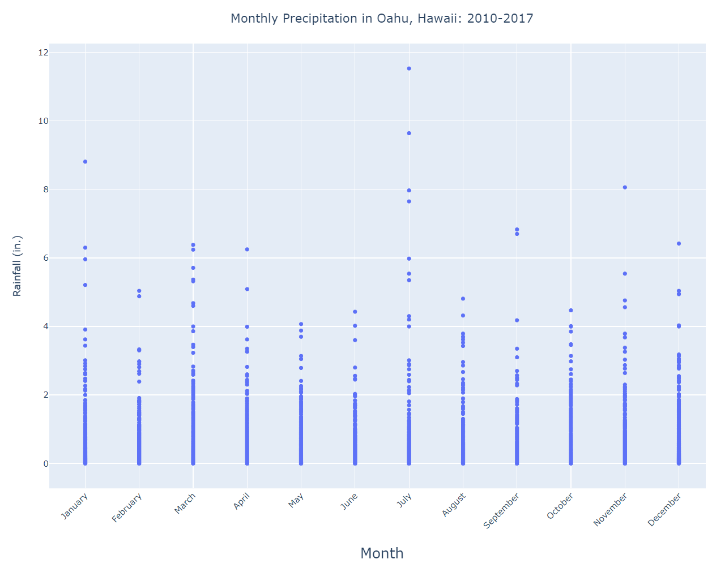

# Surf's Up - Module 9 Challenge
UNC Chapel Hill Data Analytics Bootcamp

## Overview of Project
For Module 9, SQLAlchemy, Pandas, and NumPy were used in conjunction with Jupyter Notebook and SQLite to show temperature trends for Oahu, Hawaii, in June and December. The client wants to open a surf and ice cream shop in the given location, and wants to confirm the potential business' year-long sustainability. Using the SQLite database, summary statistics for the temperatures in June and December were displayed, showing the viability of the proposed shop.

## Results
### D1: June
* Temperatures taken from: 2010 to 2017
* Average temperature: 74.9°F
* Median temperature: 75°F
* Minimum temperature: 64°F
* Maximum temperature: 85°F
* Total number of data points: 1700

June Temperature Summary

### D2: December
* Temperatures taken from: 2010 to 2016
* Average temperature: 71.0°F
* Median temperature: 71°F
* Minimum temperature: 56°F
* Maximum temperature: 83°F
* Total number of data points: 1517

December Temperature Summary

## Summary
From the 1,700 total data points in June from 2010 to 2017, Oahu, Hawaii's temperatures stayed between 64°F and 85°F, with an average of around 75°F. From the 1,517 total data points in December from 2010 to 2016, the area's temperatures remained between 56°F and 83°F, with an average of 71°F. While this level of information is useful in determining whether or not Oahu is a good area to open a surf and ice cream shop, there are many other queries and visualizations that could further prove (or disprove) the location's viability.

* June and December Boxplots:
  * Boxplots are a highly efficient way to quickly view and compare key calculations from a dataset. By plotting the temperature data from June and December in a boxplot, we can more clearly see that, generally, the highest temperatures recorded are within a couple degrees of each other, but the third quartile, median, first quartile, and lowest temperatures are further apart. Boxplots' outlier function is also helpful in determining which datapoints are unusual for the dataset - in this case, which temperatures are unusually high or low. Click the arrow below to show the figure.
    
  

  
June and December Temperatures

        
  
        
  

        
* Comparing Stations:
  * By querying the stations, we can see how many datapoints each station has collected over the years and how they differ from each other. As they are located in different areas within Oahu, we can gain a better understanding of general temperature patterns throughout the island; if we want to place our shop in a cooler area, we can calculate which stations tend to record lower temperatures and narrow down potential shop locations based on the locations of those stations. Click the arrow below to show the figure.
    
  

  
June Temperatures By Station

        
  
        
  

* Viewing monthly temperature trends:
  * By splitting the collected temperatures by month, general trends in temperatures can be seen. While we originally looked at the temperatures for June and December - presumably because they were assumed to be the hottest and coldest months of the year, respectively - we can now see that August is generally the hottest month and January is generally the coldest. It's also much easier to see general yearly trends. From this figure, we can see that median temperatures stay between 69°F and 76°F throughout the year, and the majority of datapoints (those within the first and third quartiles) stay within the range of 66°F to 79°F. Click the arrow below to show the figure.
    
  

  
Temperatures Across Months

      
  
      
  

* Precipitation data:
  * Temperature isn't the only useful weather data for determining a location's viability; precipitation also plays a role in consumers' willingness to shop and surf. Querying the same stations, we can gather precipitation data and create a scatterplot to see general rainfall trends. Click the arrow below to show the figure.
    
  

  
Precipitation Across Months

        
  
        
  

NOTE: The work behind the displayed figures can be found in [SurfsUp_Challenge_With_Visualizations.ipynb](https://github.com/sburton7395/surfs_up/blob/main/SurfsUp_Challenge_With_Visualizations.ipynb). In the file, users can hover their mouse over each figure to see key points and individual datapoints.
